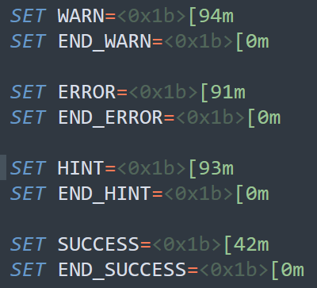
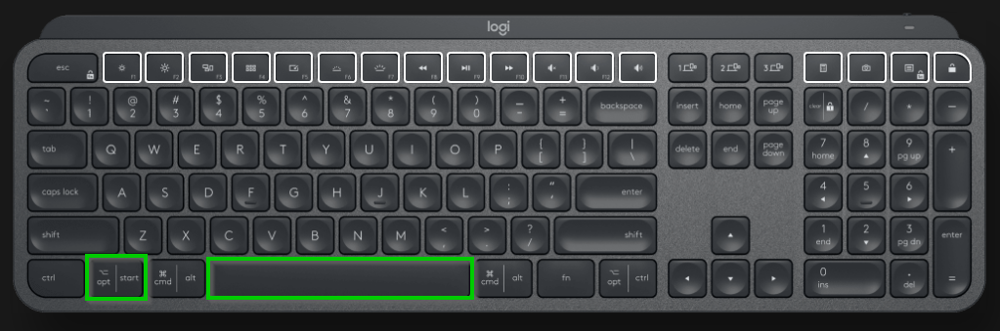

# Windows note

## Find the OS encoding

Execute the code below under PowerShell:

```
C:\Users\dbeurive> Get-WinSystemLocale | Select-Object Name, DisplayName, 
>>                 @{ n='OEMCP'; e={ $_.TextInfo.OemCodePage } }, 
>>                 @{ n='ACP';   e={ $_.TextInfo.AnsiCodePage } } 
```
 
Result:

```
Name  DisplayName       OEMCP  ACP 
----  -----------       -----  --- 
fr-FR français (France)   850 1252 
```
 
List of code pages: [https://docs.microsoft.com/fr-fr/windows/win32/intl/code-page-identifiers](https://docs.microsoft.com/fr-fr/windows/win32/intl/code-page-identifiers)

* **OEMCP** (OemCodePage) represents the code page used for console applications (DOS).
* **ACP** (AnsiCodePage) represents the code page used for graphical applications.

GUI applications use the following code page:

`1252` => `windows-1252` aka `ANSI Latin 1; Europe occidentale (Windows)`

## Get/set the keyboard layout

Get a textual description:

    Get-WinUserLanguageList

Or

Get a numerical ID:

    (Get-Culture).keyboardLayoutID

> This ID is listed [here](https://learn.microsoft.com/en-us/windows-hardware/manufacture/desktop/windows-language-pack-default-values?view=windows-11).

Set the layout:

    Set-WinUserLanguageList -LanguageList fr-FR

## Show environment variables

```Batchfile
set
```

> * System: `reg query "HKEY_LOCAL_MACHINE\SYSTEM\CurrentControlSet\Control\Session Manager\Environment"`
> * User: `reg query HKEY_CURRENT_USER\Environment`

## UNIX "find" equivalent

```Batchfile
dir /s /b
dir /s /b "%HOMEPATH%"
dir /s /b "%HOMEPATH%" | findstr .html
dir /s /b "%HOMEPATH%" | findstr /i .html
```

## UNIX "cat" equivalent

```
type <file name>
```

## UNIX "rm -rf" equivalent

```Batchfile
rmdir <directory path> /s /q
```

## Delete all files excepts certain files

```Batchfile
REM Delete all files except ".gitignore" and "clean.bat".

echo off
REM Prevent unexpected behaviour that may lead to the removal of all files
REM including the ones that we want to keep.
set PWD=%~dp0
cd %PWD%

for %%i in (*) do (
    if not "%%i" == ".gitignore" (
         if not "%%i" == "clean.bat" (
            echo "Remove %%i"
            del "%%i"
         )
    )
)
```

## Get the return value of a command

```Batchfile
echo %errorlevel%
```

> Unix equivalent: `echo $?`

## Load a password from a file

```Batchfile
SET /p PASSWORD=<password.txt
echo %PASSWORD%
```

## Get the path to this script

`PWD` is the path to the executed `.BAT` script's directory.

```Batchfile
SET PWD=%~dp0
```

> Example: `C:\Users\denis.beurive\Documents\`

If you want to remove the last "`\`"

```Batchfile
SET PWD=%~dp0
SET PWD=%PWD:~0,-1%
```

> Example: `C:\Users\denis.beurive\Documents`

## Get the current timestamp

```Batchfile
SET NOW=%date:~-4%%date:~3,2%%date:~0,2%%time:~0,2%%time:~3,2%%time:~6,2%
```

## Script to backup the current directory


```Batchfile
SET PWD=%~dp0
SET PWD=%PWD:~0,-1%
SET NOW=%date:~-4%%date:~3,2%%date:~0,2%%time:~0,2%%time:~3,2%%time:~6,2%
SET ARCHIVE="%PWD%\..\project-%NOW%.tar.gz"

cd "%PWD%"..
tar --exclude=cmake-* --exclude=.git --exclude=.idea -czvf %ARCHIVE% "%PWD%\*"
echo "Archive: " %ARCHIVE%
```

## MSDOS colors



Usage:

```Batchfile
IF not exist src\ (
  echo %WARN%WARNING: no sub direcory "src" found under GOPATH.%END_WARN%
)
```

> See: [https://gist.githubusercontent.com/mlocati/fdabcaeb8071d5c75a2d51712db24011/raw/b710612d6320df7e146508094e84b92b34c77d48/win10colors.cmd](https://gist.githubusercontent.com/mlocati/fdabcaeb8071d5c75a2d51712db24011/raw/b710612d6320df7e146508094e84b92b34c77d48/win10colors.cmd)

## OpenSSH for Windows

* OpenSSH for Windows: see [this link](http://sshwindows.sourceforge.net/)
* Default installation directory: `"%PROGRAMFILES(X86)%\OpenSSH"`
* Path to the SSH configuration files: `"%HOMEPATH%\.ssh"`

> Useful [link](https://www.thewindowsclub.com/system-user-environment-variables-windows) for Windows environment variables.

> Windows comes with OpenSSH preinstalled:
> 
> ```
> C:>where ssh
> C:\Windows\System32\OpenSSH\ssh.exe
> ```

## List open ports with the names of the associated process

```
netstat -aonb
```

## Select the keyboard language

On a Windows keyboard: [Windows] + [Spacebar]

Logitech MX-Keys: 



## PoserShell

Create an object and print its properties.

```powsershell
$xml = New-Object -TypeName XML
$xml | Get-Member
```

## Find + grep équivalent

Use PowerShell:

```powsershell
Get-Childitem –Path 'C:\Program Files\Microsoft Visual Studio' -Include link.exe -File -Recurse -ErrorAction SilentlyContinue | Select-Object FullName | Select-String -Pattern "Hostx64\\x64" -AllMatches
```

But, be careful:

```powsershell
Get-Childitem –Path 'C:\Program Files' -Include subl.exe -File -Recurse -ErrorAction SilentlyContinue | Select-Object FullName | Select-String -Pattern "\\subl.exe" -AllMatches

@{FullName=C:\Program Files\Sublime Text\subl.exe}
```

> Do you see the end of the line ?

So, if you want to be very selective:

```powsershell
Get-Childitem –Path 'C:\Program Files' -Include subl.exe -File -Recurse -ErrorAction SilentlyContinue | Select-Object FullName | Select-String -Pattern "\\subl.exe\}?$" -AllMatches
```

## PowerShell environement variables

* **print the value of a variable**: `$env:HOMEPATH\Documents`
* **interpolation**: `ls $env:ProgramFiles` or `ls ${env:ProgramFiles(x86)}`
* **print all variables**: `gci env:* | sort-object name`

## PowerShell ls équivalent

```powsershell
ls | sort LastWriteTime -Descending | Select -First 5
```

## PowerShell Unzip

```powsershell
Expand-Archive $env:HOMEPATH\Downloads\OpenSSH-Win64.zip -DestinationPath $env:HOMEPATH\Documents
```
## Execute a PowerShell script that setups a terminal environment (equivalent to "source")

```powsershell
powershell.exe -NoExit -ExecutionPolicy Bypass -File .\setup.ps1
```

> Please note the use of the option "`-NoExit`".

## Execute a command which path contains a space

Example: 

```powsershell
& "C:\Program Files\CMake\bin\cmake-gui"
```

## Create a BAT file that opens the current directory with SublimeText 

```Batchfile
SET PWD=%~dp0

"C:\Program Files\Sublime Text\subl.exe" %PWD%
```
